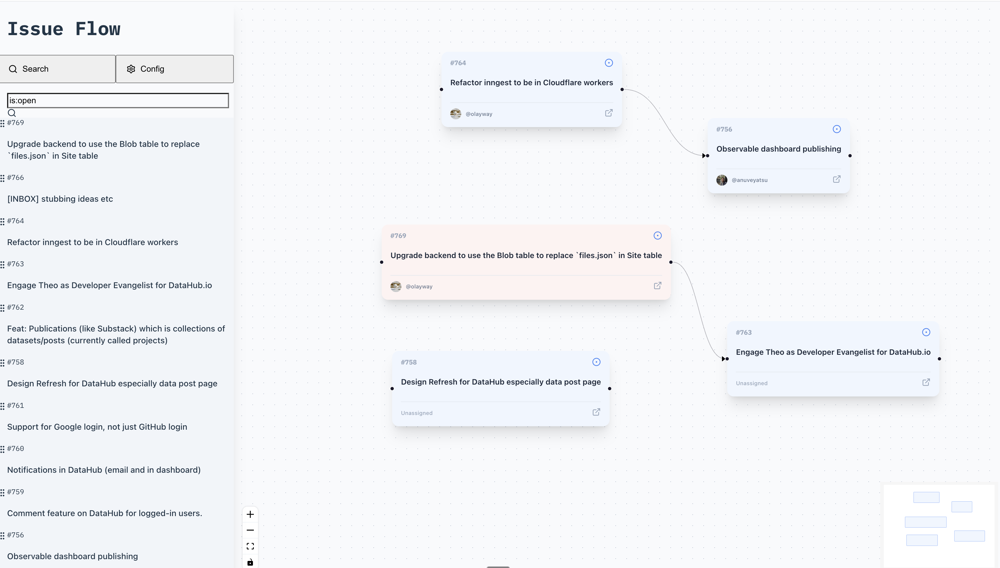

# Issue Flow

**Issue Flow is a visual tool to help you map out, understand, and plan your GitHub issues.**

Instead of flat lists, Issue Flow lets you arrange issues on an infinite canvas. By creating visual connections between them, you can build intuitive dependency graphs, map out epics, or plan sprints in a way that makes sense to you.



## Key Features

- **Visual Canvas:** Drag and drop GitHub issues directly onto an infinite canvas.
- **Connect Issues:** Draw connections between issues to represent dependencies, relationships, or workflow.
- **GitHub Search:** Find issues from any public or private repository using standard GitHub search queries.
- **Customizable Nodes:** Set colors for different issue statuses to quickly identify their state.
- **Local Persistence:** Your canvas, nodes, and connections are automatically saved in your browser's local storage.

## Getting Started

1.  **Clone the Repository**
    ```bash
    # Replace with the actual repository URL
    git clone https://github.com/your-username/issueflow.git
    cd issueflow
    ```

2.  **Install Dependencies**
    ```bash
    npm install
    ```

3.  **Run the Development Server**
    ```bash
    npm run dev
    ```
    The application will be available at `http://localhost:5173` (or the next available port).

## How to Use

1.  **Configure Your Token:**
    - Open Issue Flow in your browser.
    - Click on the **Config** tab in the sidebar.
    - **Add a GitHub Personal Access Token.** A classic token with `repo` scope is required to search for issues. [How to create a token](https://docs.github.com/en/authentication/keeping-your-account-and-data-secure/managing-your-personal-access-tokens).
    - Optionally, add a default repository in the format `owner/repo` (e.g., `facebook/react`) to scope your searches.

2.  **Find and Add Issues:**
    - Go to the **Search** tab.
    - Use the input field to search for issues (e.g., `is:open label:bug`). If you set a default repo, it will be automatically included in the search.
    - Drag issues from the search results onto the canvas.

3.  **Organize Your Canvas:**
    - Drag issues around to arrange them.
    - Click and drag from the handle on the right side of one node to the handle on the left side of another to create a connection.
    - Right-click a node to open the context menu, where you can change its color or delete it.

## Tech Stack

- **Frontend:** React with Vite & TypeScript
- **Styling:** A custom, minimal set of utility classes inspired by Tailwind CSS.
- **Canvas/Graphing:** React Flow
- **GitHub Integration:** Octokit

---
*This project was bootstrapped from a standard Vite + React template.*

