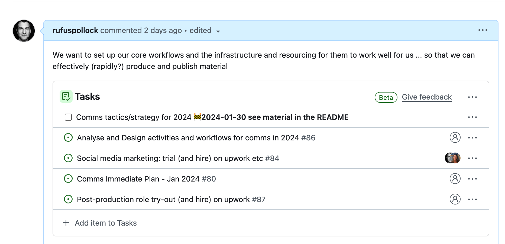

Example today re sensemaking and wanting a DAG (directed acyclic graph) for tasks ... e.g. here strategy can proceed *somewhat* in parallel with other tasks but no way to indicate that. i.e. no way to indicate what is parallelizable and what is not etc.

